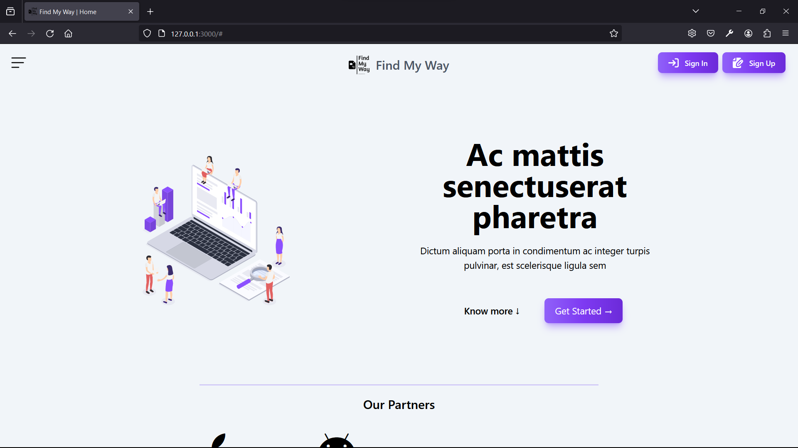

# Find My Way

- https://findmyway.onrender.com


## Description
Welcome to Find My Way, a Node.js web application designed to provide valuable information and resources to enhance the living conditions of disabled individuals. Our goal is to empower and support the disabled community by offering tips, job opportunities, and other relevant information.

## Features
- **User-Friendly Interface:** The website boasts an intuitive and accessible design to cater to users of all abilities.
- **Tips and Resources:** Access a wide range of tips and resources aimed at improving the quality of life for disabled individuals.
- **Job Listings:** Explore job opportunities tailored to the needs and abilities of disabled individuals.
- **Community Support:** Connect with others in the disabled community for shared experiences and support.

## Installation
1. Make sure you have [Node.js](https://nodejs.org/) installed on your machine.
2. Clone the repository:
   ```bash
   git clone https://github.com/your-username/find-my-way.git](https://github.com/Harsh-nodejs/Project-App.git)https://github.com/Harsh-nodejs/Project-App.git
   cd Project-App
   ```
3. Install the node js depedencies from package.json :
   ```bash
   npm install
   ```
   
## Screenshots
- 
